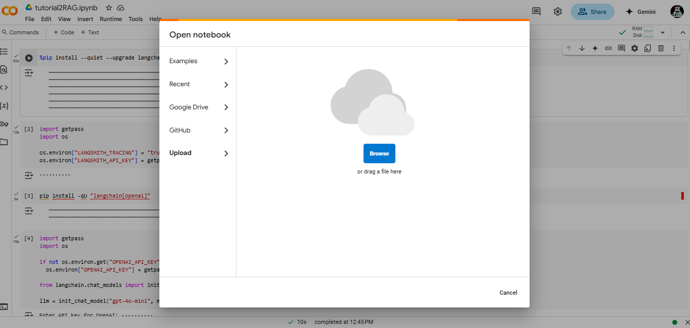
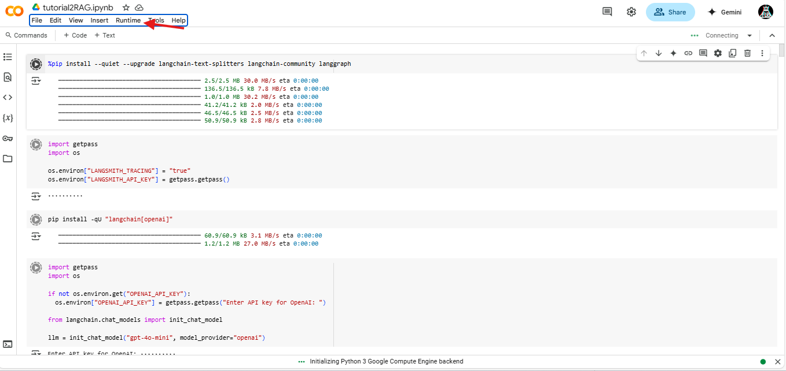
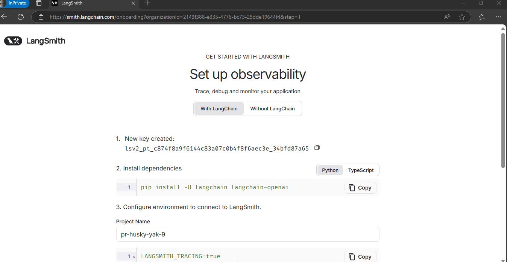
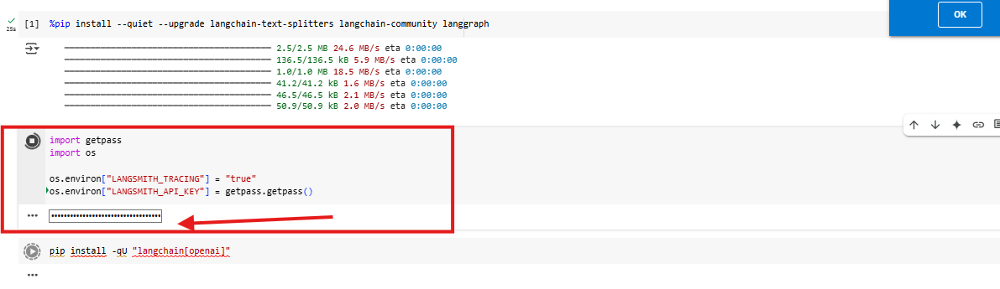
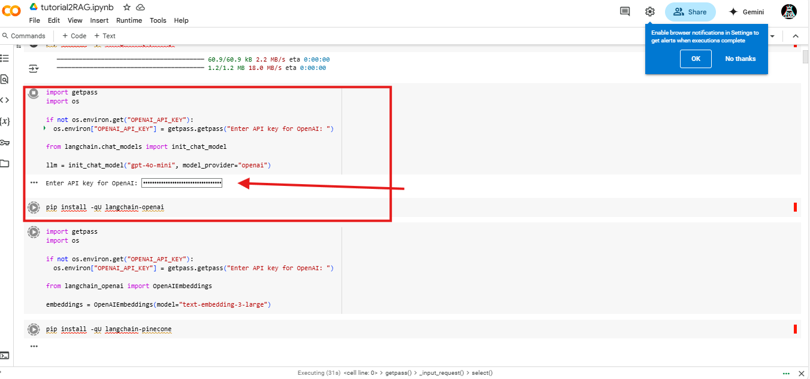
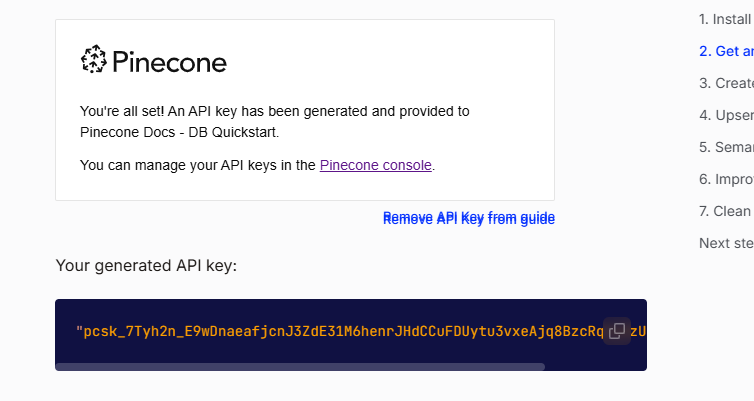
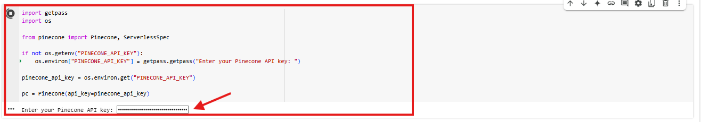

# LLM-Chain-tutorial-PART1
Este proyecto implementa una aplicación basada en LangChain para demostrar las funcionalidades básicas de interacción con modelos de lenguaje. Se siguieron los pasos descritos en los Tutoriales de LangChain.

El proyecto proporciona un entorno para explorar el uso de LangChain, permitiendo la creación de plantillas de prompts, cadenas de procesamiento con memoria y manejo de mensajes personalizados. Se incluyen ejemplos detallados de archivos de cliente y servidor para gestionar las solicitudes y respuestas de los modelos de lenguaje.


## Comenzando
Estas instrucciones te permitirán obtener una copia del proyecto y ponerlo en marcha en tu máquina local.

## Requisitos previos

### Clonar el repositorio
Clona el repositorio en tu máquina local:

```
    git clone https://github.com/JeissonCasallas09/LLM-Chain-tutorial-PART1/blob/main/tutorial1.ipynb
```

### Colab

Debemos tener una cuenta de google e ingresaremos a un entorno en colab desde el cual poder probar nuestro programa

1. Una vez adentro vamos a cargar nuestro notebook.


2. Una vez cargado vamos a la sección de runtime y le damos a dar a la opción de "Run all"



3. Ahora debemos en el espacio requerido ingresar una APIKEY de langSmith, para generarla iremos al siguiente link


```
https://smith.langchain.com/onboarding?organizationId=2143f388-e335-4776-bc73-25dde19644f4&step=1
```

Damos click a "Generate API Key"




4. Ingresamos la llave y vemos como se termina de ejecutar correctamente.



5. Ahora nos va a requerir una API Key de OpenAI, para ello debemos ir a la pagina oficial para generarla, en este caso, ya nos fue suministrada por el profesor.



Una vez ingresada terminara de ejecutar el resto del notebook.

6. Como podemos ver tenemos una inteligencia capaz de traducir de un lenguaje a otro, en este caso vemos que lo pasa de ingles a italiano, segun el idea que se le ingrese.



### Pruebas

Podemos hacer mas pruebas con otros lenguajes, en este caso de ingles a español modificando los siguientes campos.


Ya tendriamos hecho nuestro traductor.

## Arquitectura

## Diagrama de arquitectura


### Explicación del Diagrama

El diagrama describe las principales interacciones dentro del notebook:

#### 1. Configuración del Entorno:

* El usuario establece las claves API necesarias (LANGSMITH_API_KEY, OPENAI_API_KEY) para autenticar las solicitudes.

#### 2. Inicialización del Modelo:

* Se inicializa el modelo GPT-4o-mini de LangChain.

#### 3. Procesamiento de Mensajes:

* Los mensajes enviados al modelo pueden ser de tipo SystemMessage o HumanMessage.

* El modelo procesa estos mensajes y genera respuestas.

#### 4. Interacción con el Modelo:

* El usuario puede invocar el modelo enviando un único mensaje.

* También es posible transmitir mensajes en flujo (streaming) para recibir respuestas de forma continua.


## Built With

- [LangChain](https://langchain.com/) - Library for developing LLM applications.
- [Colab](https://colab.research.google.com/notebooks) - Interactive development environment.
- [OpenAI](https://openai.com/) - Language model provider.

## Versioning

I use [GitHub](https://github.com/) for versioning. For the versions available, see the [tags on this repository](https://github.com/alexandrac1420/LLM_PrimeraParte.git).

## Authors

- **Jeisson Casallas** - [Jeissoncasallas09](https://github.com/JeissonCasallas09)

## License

This project is licensed under GNU.


