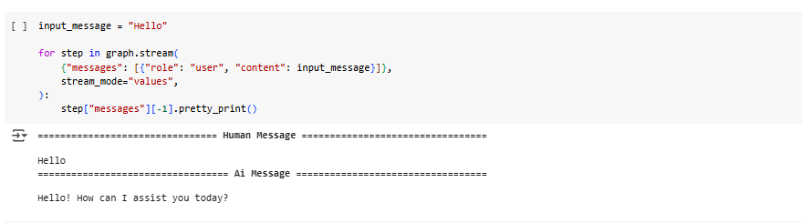
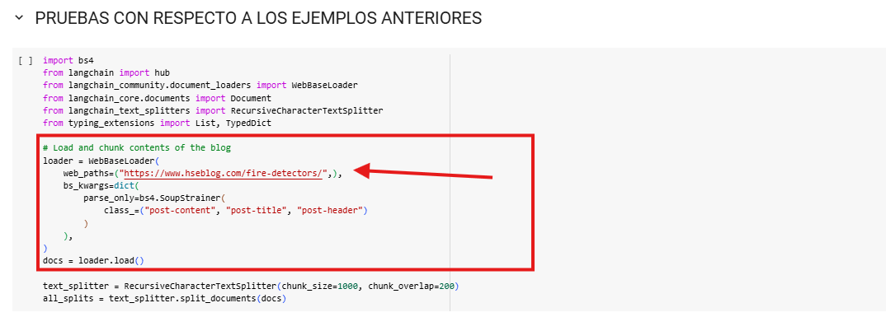
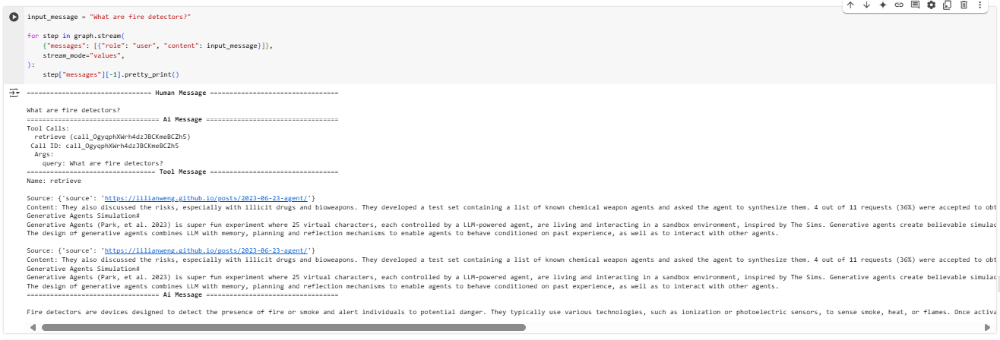

# LLM-Chain-tutorial-PART1
Este proyecto implementa una aplicación basada en LangChain para demostrar las funcionalidades básicas de interacción con modelos de lenguaje. Se siguieron los pasos descritos en los Tutoriales de LangChain.

El proyecto proporciona un entorno para explorar el uso de LangChain, permitiendo la creación de plantillas de prompts, cadenas de procesamiento con memoria y manejo de mensajes personalizados. Se incluyen ejemplos detallados de archivos de cliente y servidor para gestionar las solicitudes y respuestas de los modelos de lenguaje.


## Comenzando
Estas instrucciones te permitirán obtener una copia del proyecto y ponerlo en marcha en tu máquina local.

## Requisitos previos

### Clonar el repositorio
Clona el repositorio en tu máquina local:

```
    git clone https://github.com/JeissonCasallas09/LLM-Chain-tutorial-PART1/blob/main/tutorial1.ipynb
```

### Colab

Debemos tener una cuenta de google e ingresaremos a un entorno en colab desde el cual poder probar nuestro programa

1. Una vez adentro vamos a cargar nuestro notebook.


2. Una vez cargado vamos a la sección de runtime y le damos a dar a la opción de "Run all"


3. Ahora debemos en el espacio requerido ingresar una APIKEY de langSmith, para generarla iremos al siguiente link


```
https://smith.langchain.com/onboarding?organizationId=2143f388-e335-4776-bc73-25dde19644f4&step=1
```

Damos click a "Generate API Key"


4. Ingresamos la llave y vemos como se termina de ejecutar correctamente.


5. Ahora nos va a requerir una API Key de OpenAI, para ello debemos ir a la pagina oficial para generarla, en este caso, ya nos fue suministrada por el profesor.


6. Por ultimo nos faltara la APIKEY de Pinecode, la cual debemos obtener a traves del siguiente link:

```
https://docs.pinecone.io/guides/get-started/quickstart
```


6. Como podemos ver tenemos una inteligencia capaz de traducir de un lenguaje a otro, en este caso vemos que lo pasa de ingles a italiano, segun el idea que se le ingrese.

Una vez ingresada terminara de ejecutar el resto del notebook.


7.  Ahora podemos ingresar una entrada a nuestra inteligencia y ver los resultados obtenidos.



### Pruebas

Podemos hacer mas pruebas con otros lenguajes, en este caso de ingles a español modificando los siguientes campos.

1. si queremos hacer pruebas con alguna pagina en especifico, debemos cambiar el siguiente recurso, en este caso usaremos uno sobre detectores de incendios.




2. Ahora podremos ver que respondio la inteligencia en base al recurso suministrado con la que se entreno.

#### **prueba 1**




#### **prueba 2**


#### **prueba 3**


Ya tendriamos hecho nuestro modelo de inteligencia capaz de responder preguntas.

## Arquitectura

## Diagrama de arquitectura


### Arquitectura del Sistema RAG con LangChain y Pinecone
Este diagrama representa la arquitectura del sistema implementado en el notebook. Se trata de un flujo de Recuperación Aumentada con Generación (RAG) basado en LangChain, Pinecone y OpenAI. La arquitectura se ejecuta en un entorno Jupyter Notebook y sigue los siguientes pasos:

### 1. Interacción del Usuario

* El usuario realiza una pregunta o consulta en el sistema.

* La consulta es procesada por LangChain Core, el cual se encarga de orquestar el flujo de información.

### 2. Procesamiento de Documentos

* Si la consulta requiere información almacenada, LangChain Core utiliza un Loader de Documentos para cargar archivos de texto, PDFs u otros formatos.

* Luego, los documentos se fragmentan en partes más pequeñas mediante el Text Splitter, facilitando la indexación y búsqueda eficiente.

### 3. Almacenamiento y Recuperación Semántica

* Los fragmentos de texto generados son convertidos en embeddings y almacenados en Pinecone (Vector Store).

* Cuando el usuario realiza una consulta, LangChain consulta Pinecone para recuperar los documentos más relevantes según la similitud semántica.

### 4. Generación de Respuesta con OpenAI

* Los documentos recuperados son enviados junto con la pregunta original a OpenAI Model (GPT-4o-mini).

* OpenAI procesa la información y genera una respuesta en lenguaje natural.

### 5. Monitoreo y Flujo de Agentes

* LangSmith se encarga de la trazabilidad del proceso, permitiendo analizar el desempeño del modelo y la eficiencia de las consultas.

* LangGraph es utilizado para la gestión de flujos complejos, asegurando que los agentes sigan una lógica estructurada al interactuar con diferentes componentes.

### 6. Devolución de Respuesta

* Finalmente, la respuesta generada es enviada de vuelta al usuario.

### Beneficios de esta Arquitectura
✅ Escalabilidad: La arquitectura permite añadir nuevos documentos sin modificar la estructura principal.

✅ Eficiencia: Gracias a Pinecone, las consultas son rápidas y precisas.

✅ Trazabilidad: LangSmith permite monitorear el rendimiento del sistema.

✅ Modularidad: Los componentes como LangGraph y OpenAI API pueden intercambiarse o mejorar sin afectar el flujo general.


## Built With

- [LangChain](https://langchain.com/) - Library for developing LLM applications.
- [Colab](https://colab.research.google.com/notebooks) - Interactive development environment.
- [OpenAI](https://openai.com/) - Language model provider.

- [PineCone](https://www.pinecone.io) - Vector database
## Versioning

I use [GitHub](https://github.com/) for versioning. For the versions available, see the [tags on this repository](https://github.com/alexandrac1420/LLM_PrimeraParte.git).

## Authors

- **Jeisson Casallas** - [Jeissoncasallas09](https://github.com/JeissonCasallas09)

## License

This project is licensed under GNU.
